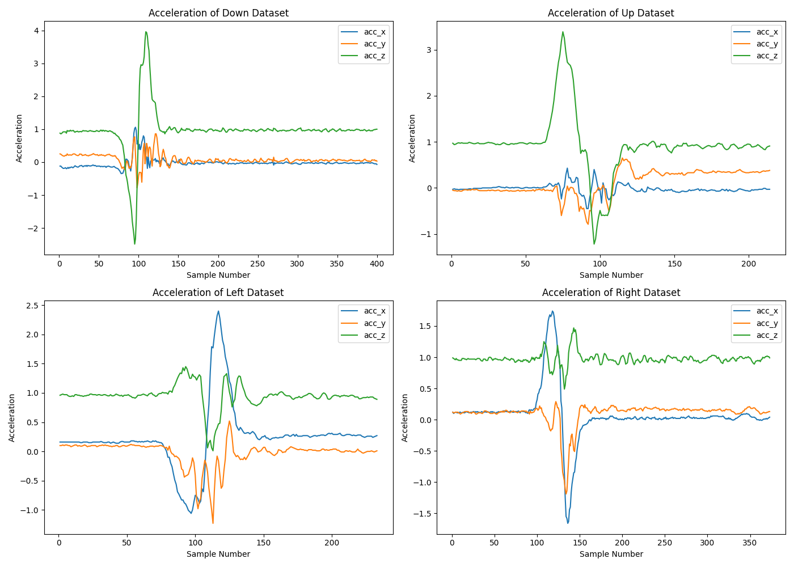
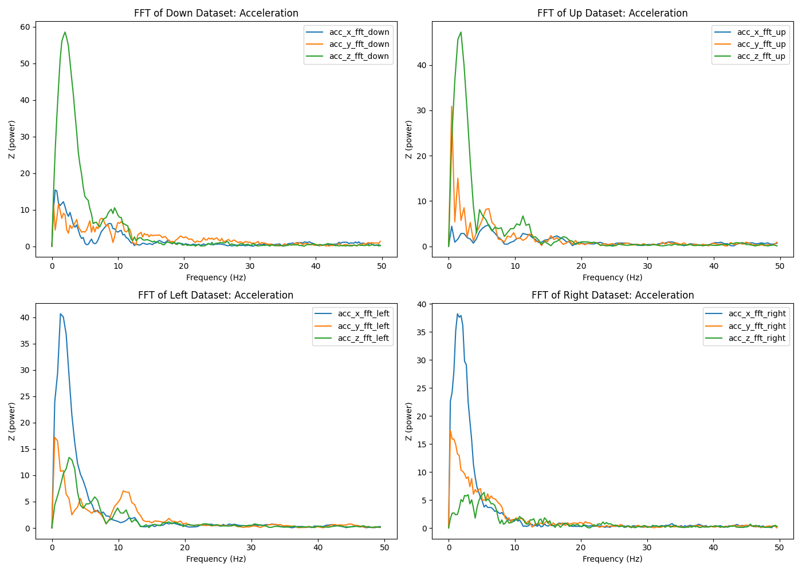
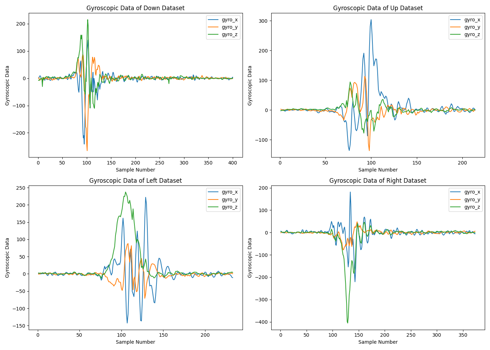
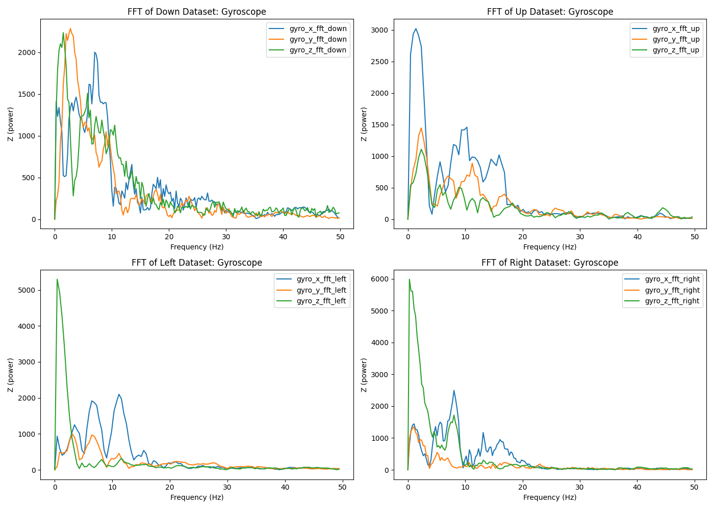

# Gesture Analysis

This repository contains code for the output and processing of acceleration, 
gyroscopic, and temperature data from an IMU sensor connected to an ESP32S3. 

- main.c: build and flash to ESP32S3 to output x, y, z acceleration and gyroscope data as well as temperature to monitor
- get_data.py: listens to output from ESP32S3 and outputs to csv file when user hits CTRL C. 
- analyze_data.ipynb: analysis code for IMU data. 
- sensor_data_down.csv, sensor_data_up.csv, sensor_data_left.csv, sensor_data_right.csv contain the data for each gesture

# Assignment Report

## Procedure

To capture my acceleration and gyroscope data, I ran get_data.py, which read the serial output from the ESP32. In main.c, I set the ESP32 to output sensor data 100 times a second, meaning my sampling rate was 100 hz. When CTRL C was hit, get_data.py processed my output into a pandas dataframe, where it was saved as a csv. 
I performed this procedure 4 times with up, down, left, and right movements and saved the CSV’s with a name corresponding to their gesture.

## Results

### Acceleration

### FFT of Acceleration

### Gyroscopic Data

### FFT of Gyroscopic Data

## Analysis

A Fast Fourier Transform on motion data such as the data above translates a signal from its time domain to a frequency domain. What this does is allows us to examine the power of different frequencies of motion. Taking a look at the FFT’s of the acceleration data, you can see the significance of low frequencies among z-axis acceleration in the up and down motion datasets, while in the FFT’s of the left and right motion datasets, low frequencies among x-axis acceleration predominate. What this shows is that large, low frequency signals were actually properly captured by the sensor that is not noise, allowing for easy identification through machine learning later on. 

